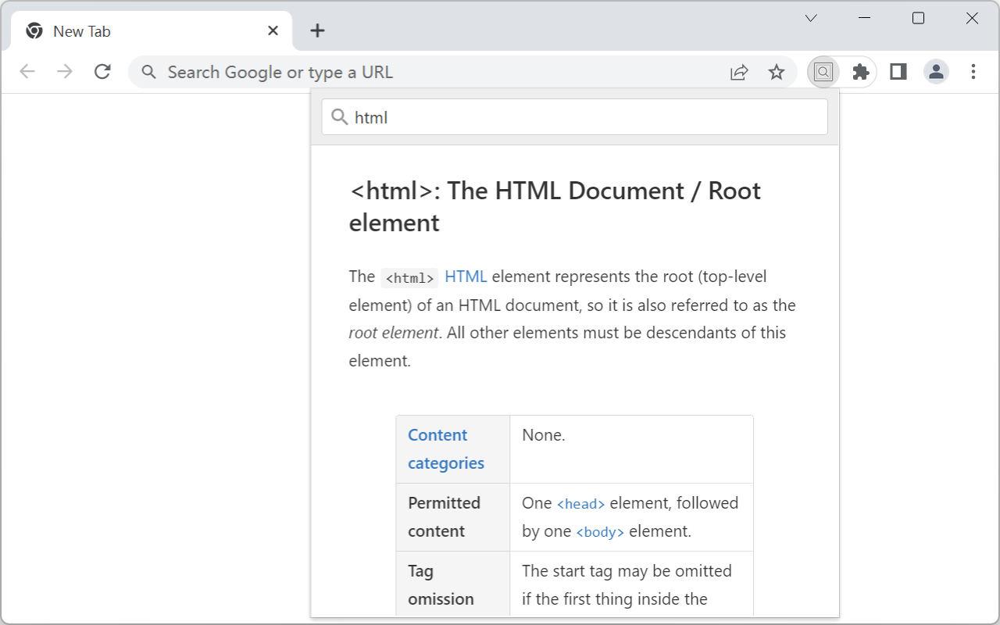
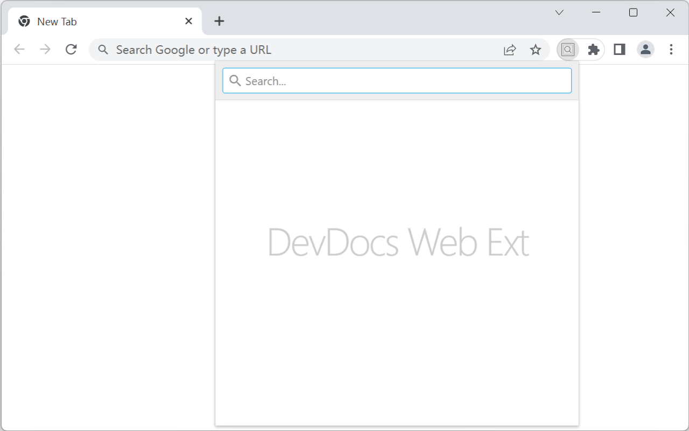
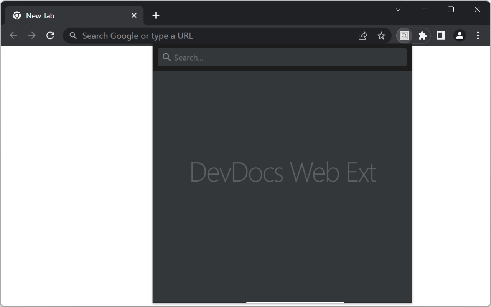
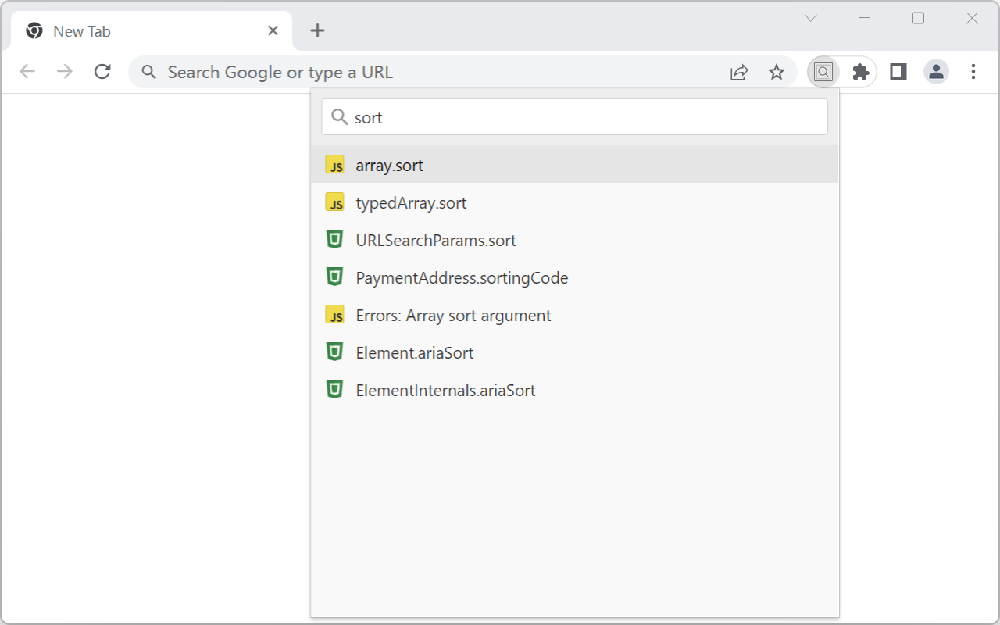
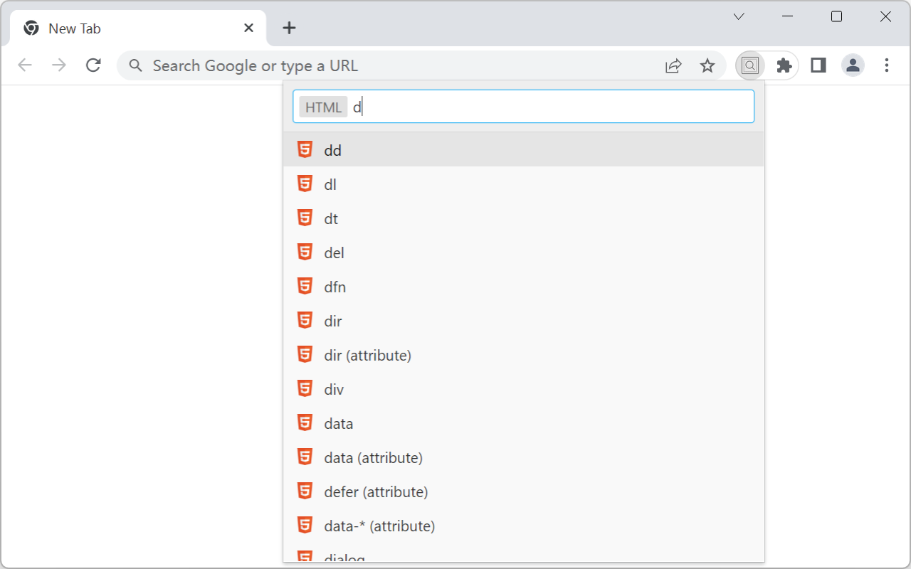
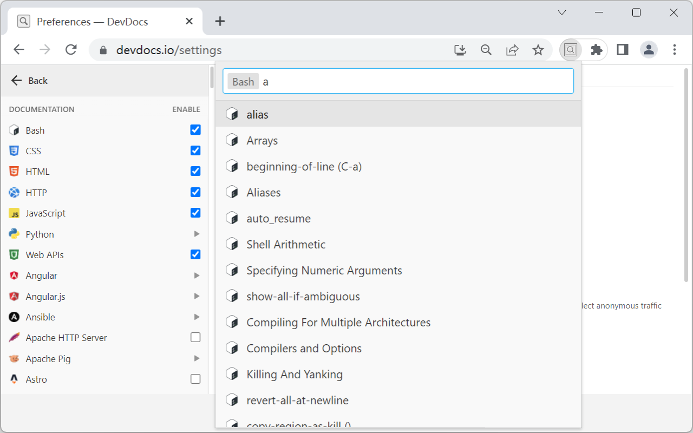
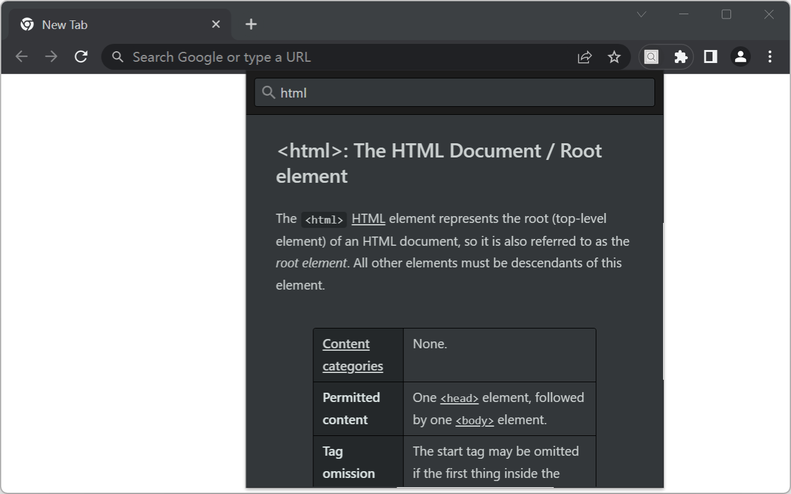

<p align="center">
  
</p>

<h1 align="center">DevDocs Web Ext</h1>

[](https://chrome.google.com/webstore/detail/devdocs-web-ext/kdjoccdpjblcefijcfhnjoljodddedpj)
[](https://chrome.google.com/webstore/detail/devdocs-web-ext/kdjoccdpjblcefijcfhnjoljodddedpj) [](https://chrome.google.com/webstore/detail/devdocs-web-ext/kdjoccdpjblcefijcfhnjoljodddedpj)

## Overview
DevDocs Web Ext is a browser extension that allows you to quickly search and browse online documentations, from within your browser.



## Features
+ Quick access to documentation for over 200 development libraries provided by [DevDocs]([devdocs](https://devdocs.io)).
+ Search in a certain library or a certain version of the library.
+ Dark theme is supported.

## Install
### Chrome / Chromium based browsers (Vivaldi, Brave, etc.)
Visit [Chrome Web Store](https://chrome.google.com/webstore/detail/quick-devdocs/kdjoccdpjblcefijcfhnjoljodddedpj) to install it.

[](https://chrome.google.com/webstore/detail/quick-devdocs/kdjoccdpjblcefijcfhnjoljodddedpj)

### Microsoft Edge
Visit [Microsoft Edge Add-ons](https://chrome.google.com/webstore/detail/quick-devdocs/kdjoccdpjblcefijcfhnjoljodddedpj) to install it.

[](https://chrome.google.com/webstore/detail/quick-devdocs/kdjoccdpjblcefijcfhnjoljodddedpj)

## Usage
To use DevDocs Web Ext, simply click on the extension icon in your browser's toolbar to open the popup window. From there, you can search for the library you need and browse through its documentation.

You can also click open the options page to customize the extension's behavior, including changing your appearance and theme.

## Screenshots
| Description | Screenshot |
|---|---|
| Open the extension |  |
| Dark mode |  |
| Search |  |
| Press <kbd>Tab</kbd> to select a certain documentation, <br> then search in this documentation |  |
| Select a new documentation in [devdocs.io](https://devdocs.io) |  |
| Read an article from the documentation |  |
| Read an article in dark mode |  |

## Contributing
DevDocs Web Ext is an open-source project, and contributions are always welcome! If you have an idea for a new feature, find a bug, or just want to help out, feel free to submit a pull request or open an issue on our GitHub page.

## Development

Here is a simple overview about how to set up development environment.
```sh
git clone https://github.com/arianrhodsandlot/DevDocs-Web-Ext.git
cd DevDocs-Web-Ext
pnpm i

# start a fresh browser using Playwright with the develop version extension installed
pnpm dev

# run test cases locally
pnpm t

# debug test cases
pnpm playwright test -c tests --debug
# or
PWDEBUG=console p playwright test -c tests
```

## Credits
DevDocs Web Ext is built on top of [DevDocs](https://devdocs.io), an amazing website for developers. Thanks to [all the contributors](https://github.com/freeCodeCamp/devdocs/graphs/contributors) who make [DevDocs](https://devdocs.io) possible!

## License

[MIT](license)
